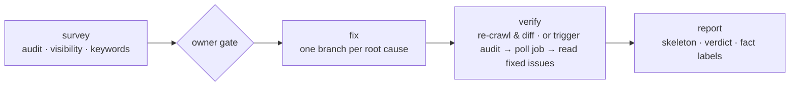

<div align="center">

# 🛠️ Groundcrew SEO

**Open SEO & growth skills your AI agent can use today.**
Connect [TrustGrowth](https://trustgrowth.ai) when you want the work measured, scheduled, prioritized — and **verified**.

[](https://github.com/techwright-lab/groundcrew-seo/releases/latest)
[](LICENSE)
[](#skills)
[](shared/contract-pin.json)
[](https://smithery.ai/servers/trustgrowth/trustgrowth)

[Install](#install) · [Skills](#skills) · [The grow loop](#the-grow-loop) · [Tiers](#three-tiers-zero-lock-in) · [Contracts](#evidence-and-contracts) · [Ethics](ETHICS.md)

</div>

---

Groundcrew SEO is a provider-flexible pack of **20 plain-Markdown skills** for any capable AI agent: site auditing, repository fixes, keyword and competitor research, AI/answer-engine visibility, authority and backlink review, content strategy, credibility review, evidence-labeled reports, standups, and a survey → fix → verify → report loop. No lock-in: every skill works with public/local evidence and validated imports; TrustGrowth adds the one thing a skill pack cannot carry — **measured history and a real verify loop**.

> Published before v0.5.0 as `groundcrew`; old GitHub URLs redirect.

## Install

```bash
curl -fsSL https://raw.githubusercontent.com/techwright-lab/groundcrew-seo/v1.1.0/install.sh | bash
```

Then ask a coding-capable agent:

> Inspect this site and repository, fix one verifiable defect, run the tests, and prepare a PR.

[`fix-my-site`](skills/fix-my-site/SKILL.md) completes that without any account. From a checked-out repository, `./install.sh --dry-run` previews and `./install.sh` installs; the installer refuses collisions by default (`--update` for a prior Groundcrew-managed install, `--force` after reviewing the exact paths, `--skills-dir PATH` to override detection).

Diagnostics, from your agent's skills directory:

```bash
<skills-dir>/.groundcrew/groundcrew-doctor.py                       # install + shared-reference drift
<skills-dir>/.groundcrew/groundcrew-doctor.py --connectivity        # TrustGrowth reachability + full/read-only contract mode
<skills-dir>/.groundcrew/groundcrew-doctor.py --evidence record.json # validate an evidence record
```

## Three tiers, zero lock-in

Skills name evidence **categories** (`~~search console`, `~~page speed`, `~~SEO tool`, `~~link database`, `~~analytics`, `~~AI monitor`), never vendors. [`shared/connectors.md`](shared/connectors.md) maps each category once:

| Tier | What it needs | What you get |
|---|---|---|
| **1 · Open** | Nothing — public fetches, pasted exports, TrustGrowth's keyless free tools | Every skill delivers value with zero keys |
| **2 · Own data** | One source you already have: a GSC or GA4 read-only MCP, a free PSI key | Your real search and analytics numbers |
| **3 · Managed / paid** | TrustGrowth, or Ahrefs / Semrush MCP, or cost-gated DataForSEO | History, issue lifecycle, verification, any-domain breadth |

Groundcrew never opens with a connector menu: it detects what is present, runs, delivers, then recommends **at most one** missing connector with a concrete benefit ([`shared/provider-selection.md`](shared/provider-selection.md)).

## Skills

### Act

| Skill | Without an account | TrustGrowth adds |
|---|---|---|
| [`grow`](skills/grow/SKILL.md) | Survey → fix → verify → report loop with owner gates | Real verification: trigger audit, poll the job, read fixed issues |
| [`fix-my-site`](skills/fix-my-site/SKILL.md) | Public/repo defect → tested PR | Prioritized evidence + re-audit closure |

### Inspect

| Skill | Without an account | TrustGrowth adds |
|---|---|---|
| [`site-audit`](skills/site-audit/SKILL.md) | Point-in-time public/local audit | Scheduled history, severity, persistence |
| [`keyword-scout`](skills/keyword-scout/SKILL.md) | Validated imports or cost-gated DataForSEO | Normalized opportunities + content awareness |
| [`competitor-watch`](skills/competitor-watch/SKILL.md) | Point-in-time observation/import | Curated tracking and movement history |
| [`eeat-review`](skills/eeat-review/SKILL.md) | Observable trust-signal checklist | Persisted proxy assessment + page evidence |
| [`ai-visibility`](skills/ai-visibility/SKILL.md) | AI-crawler/readability/citation readiness, labeled census-vs-sample imports | Visibility funnel components |
| [`authority-review`](skills/authority-review/SKILL.md) | Entity/reference/credibility standing; no invented scores | TrustGrowth's own authority pillar, named as such |
| [`backlink-opportunities`](skills/backlink-opportunities/SKILL.md) | Human-reviewed opportunity plan; never disavow, never automated outreach | Authority pillar context |
| [`content-strategy`](skills/content-strategy/SKILL.md) | Evidence-grounded pillars, sequence, measurement; owner-approved | Measured gap inputs |
| [`content-desk`](skills/content-desk/SKILL.md) | **Local/read-only inventory only** | Read-only hosted inventory; engine remains waitlist-only |
| [`standup`](skills/standup/SKILL.md) | Available evidence/artifact summary | Persisted team activity and deltas |
| [`trustgrowth`](skills/trustgrowth/SKILL.md) | Optional provider connector | Complete managed operating layer |

### Report

| Skill | Without an account | TrustGrowth adds |
|---|---|---|
| [`weekly-report`](skills/weekly-report/SKILL.md) | Crawl delta + pasted or `~~search console` numbers | Changes feed, score snapshots, verified fixes |
| [`audit-report`](skills/audit-report/SKILL.md) | Public crawl findings (+ `~~page speed` CWV) as `.md`/`.csv` | Issue history with first-seen/fixed and severity |
| [`keyword-report`](skills/keyword-report/SKILL.md) | Suggest + SERP paste; `~~search console` striking distance | Keyword lifecycle types + per-keyword history |
| [`competitor-readout`](skills/competitor-readout/SKILL.md) | Wayback/on-page diffs of tracked competitors | Observation history + content-gap keywords |
| [`geo-report`](skills/geo-report/SKILL.md) | robots/llms.txt/extractability checks | Five-stage visibility funnel |
| [`authority-report`](skills/authority-report/SKILL.md) | Links export + Open PageRank context | Authority pillar, referring-domain snapshots, prospects |
| [`score-report`](skills/score-report/SKILL.md) | Source-specific evidence report | Score history + publication-safe packet |

Every report follows one contract — [`shared/reporting.md`](shared/reporting.md): a fixed skeleton, a **SHIP / FIX / BLOCK / UNDECIDED** verdict where any veto forces BLOCK, and a **Measured / User-provided / Estimated** label on every figure. Its remediation rules keep observations, current policy, proposals, owner decisions, and rendered verification separate. Missing values stay missing — never zero, never interpolated.

## The grow loop



`grow` runs the whole loop or one `--phase`. It stops at a gate before anything irreversible or outward-facing, and a fix nothing re-observed stays **"applied, unverified"** — which caps the report's verdict below SHIP. The loop never self-restarts.

## Evidence and contracts

Three contracts keep the pack honest, and CI enforces all of them:

- **Evidence** — every normalized factual input satisfies [`shared/evidence.schema.yaml`](shared/evidence.schema.yaml) (source, observation time, provenance, confidence, limitations). `groundcrew-doctor` validates records and fails on drifted shared references.
- **API surface** — the TrustGrowth surface skills may call is **generated, not hand-written**: [`skills/trustgrowth/references/contract.md`](skills/trustgrowth/references/contract.md) is rendered from the vendored capability manifest by `scripts/gen-contract.py` and refreshed from the live manifest before release; `scripts/validate-skills.py` rejects any skill referencing a path outside it. `groundcrew-doctor --connectivity` selects full mode for the target or a newer same-major contract, read-only feature-detected mode for an older same-major contract, and hard failure for a malformed or different major. Compatibility mode permits only operations advertised by the live manifest and blocks every write.
- **Evals** — every skill carries at least 5 scenario cases under `tests/evals/` (open-tier behavior, connected behavior, honesty under missing data, a safety gate, routing); `scripts/validate-evals.py` keeps the 111-case corpus structurally sound and contract-valid. The cases are harness-agnostic and never ship in the distribution payload. Deterministic worked-example checks and the five-consumer instruction guard are separate and do not claim to execute agents.

## Optional providers

- **Own-data (Tier 2):** Google Search Console and GA4 through a read-only MCP you already run; PageSpeed Insights with a free key. Recipes in [`shared/connectors.md`](shared/connectors.md).
- **TrustGrowth (Tier 3):** create an API key in the authenticated app, set `TRUSTGROWTH_API_KEY`. REST docs: <https://trustgrowth.ai/developers> · MCP: `POST https://trustgrowth.ai/mcp`. The 13+ free tools are keyless over REST.
- **Paid indexes (Tier 3):** Ahrefs MCP / Semrush MCP when you already pay for them; DataForSEO only behind a bounded cost preflight and explicit batch approval ([`shared/dataforseo.md`](shared/dataforseo.md)).
- **Imports:** JSON/CSV-derived evidence is accepted when source, observation time, scope, provenance, confidence, and limitations are preserved.

## Boundaries

Content inventory reads work; content generation, approval, scheduling, publication, and lifecycle writes do not — the managed Growth content engine remains waitlist-only (<https://trustgrowth.ai/pricing>), and Groundcrew does not expose or imply unavailable operations. No disavows, no automated outreach, no invented scores, no promised outcomes.

[WHY-NOT-SLOP.md](WHY-NOT-SLOP.md) explains why evidence compounds trust while slop borrows against it. [ETHICS.md](ETHICS.md) enforces hard refusals, owner gates, null honesty, and claim safety.

## For maintainers

All 20 release skills live only under `skills/`; marketplace and plugin metadata is generated from that canonical source:

```bash
./scripts/generate-adapters.py --check
GROUNDCREW_PRINT_PAYLOAD=1 ./scripts/validate-distribution.py
./scripts/preview-publishers.sh
```

CI fails when generated adapters drift. Every printed publisher command remains preview-only until a human approves publication. Skills are plain Markdown and the doctor uses only Python's standard library; document tested installation targets with exact commands as they are verified.

## License

[MIT](LICENSE)

<div align="center">
<sub>Built by <a href="https://trustgrowth.ai">TrustGrowth</a> · evidence over vibes</sub>
</div>
